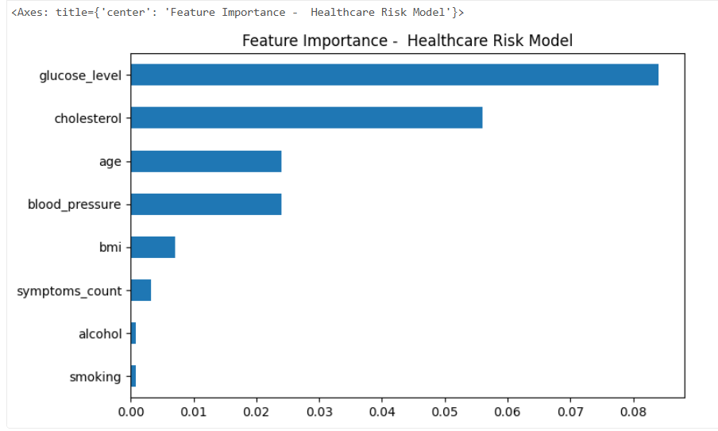

# medico-databricks-ml-pipeline
End-to-end explainable healthcare machine learning pipeline built on Databricks Community Edition using Delta Lake, MLflow, and a Bronze–Silver–Gold architecture.

# Explainable Healthcare ML Pipeline (Databricks Community Edition)

## 📌 Project Overview
This project demonstrates an end-to-end healthcare machine learning pipeline built on Databricks Community Edition, covering data engineering, ML training, experiment tracking, and explainability.

The focus is on **architecture, ML lifecycle, and realistic evaluation**, not just model accuracy.

---

## 🏗️ Architecture
Bronze → Silver → Gold → ML → MLflow → Explainability

- **Bronze**: Raw patient data ingestion
- **Silver**: Data cleaning, validation, schema enforcement
- **Gold**: ML-ready feature engineering
- **ML**: Logistic Regression model for healthcare risk prediction
- **MLflow**: Experiment tracking, metrics, model logging
- **Explainability**: Feature importance for transparent predictions

---

## 🧪 Dataset
- ~2000 **synthetic healthcare records**
- Generated programmatically (no real patient data)
- Controlled distributions + noise for realism

---

## 📊 Model Performance
- Accuracy: ~78%
- Precision: ~76%
- Recall: ~72%

Metrics became realistic after scaling data beyond toy examples.

---

## 🛠️ Tech Stack
- Databricks Community Edition
- Apache Spark & Spark SQL
- Delta Lake
- Python (pandas, scikit-learn)
- MLflow
- Explainable AI (feature importance)

---

## 🔍 Key Learnings
- Importance of data quality before ML
- Handling Delta Lake schema enforcement
- Scaling datasets for realistic ML evaluation
- Tracking experiments using MLflow
- Adding explainability in healthcare use cases

---

## ⚠️ Limitations
- CPU-only environment (Community Edition)
- Synthetic dataset
- Single baseline model (Logistic Regression)

---
## 📸 Project Screenshots

### MLflow Experiment Tracking

### Model Explainability

## 📸 Screenshots
See `/screenshots` folder for:
- MLflow experiment comparison
- Feature importance plot
- Gold feature table preview

